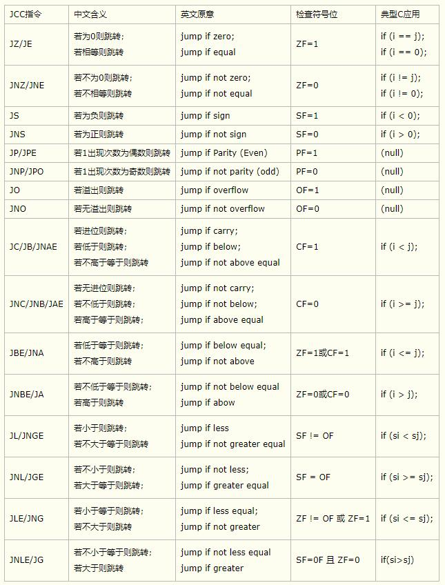

# 汇编常用指令

> AT\&T 与 INTEL 注意差异

1. INTEL mov eax,1 ;1 十进制 mov eax,01H ;1H 十六进制 a:mov eax,offset a;得到位置 mov rbp\[-12],1
2. AT\&T: mov $1,%eax ;10进制 mov $0x1,%eax ;十六进制 a:mov $ab,%eax ;a标签可重复,ab 为得到之前位置 af 为之后位置 mov $1,-12(%rbp)

> add 加

```
assume cs:code
code segment
    start:
        mov ax,10
        mov dx,1
        add ax,dx
        ; ax=11
code ends
end start
```

> sub 减

```
assume cs:code
code segment
    start:
        mov ax,10
        mov dx,1
        sub ax,dx
        ; ax=9
code ends
end start
```

> mul 乘 8_8 乘数:AL 结果:AX 16_16 乘数:Ax 结果:高AX 低DX

```
assume cs:CODES
CODES SEGMENT
START:
    ;8 位
    mov al,2
    mov bl,2
    mul dl
    ;结果 AX 4
    ;16 位
    mov ax,1000
    mov dx,1000
    mul dx
    ;结果 高AX E512 低DX 00C1
CODES ENDS
    END START
```

> div 除 除数:8(寄存器或内存) 被除:16 (AX) 结果：商(AL) 余数(AH) 除数:16(寄存器或内存) 被除:32 高16(DX) 低16(AX) 结果：商(AX) 余数(DX)

```
assume cs:code
code segment
    start:
        ; 16位除法 10/3
        mov ax,10
        mov dl,3
        div dl
        ; ah 余数 al 商
        ;32位除法 8800502 (86 48F6) / 6565 (19A5)
        mov dx,86H ;高16
        mov ax,48F6H ;低16
        mov bx,19A5H
        div bx
        ; 商(AX)053C 余数(DX) 0D4A
code ends
end start
```

> adc 进位加

```
// dome1: add ax,bx 结果 ax
// 等于如下　adc = ah+bh+CF位
add al,bl
adc ah,bh
// dome2: =>1ef000h+201000h 结果　高位ax　低位dx
mov ax,001eh
mov dx,0f000h
add dx,1000h
adc ax,0020h
```

> sbb 借位减法

```
assume cs:CODES
CODES SEGMENT
START:
    ;20001H-10002H
    ;高 16 位AX 低16 dx
    mov ax,02H
    mov dx,1
    sub dx,2
    sbb ax,1 ; 借位 AX=AX-1-CF
    ;结果 高16 AX 0000 低16 DX FFFF
CODES ENDS
    END START
```

> jmp 跳转

```
assume cs:code
code segment
    start:
        mov cx,3
        jmp jmp1
        ;...
    jmp1:
        mov ax,1
        mov cx,1
        ;...
code ends
end start
```

> movsb movsw movsd 内存转移

```
assume cs:CODES
data segment
    dw 8 dup(0)
    db 16 dup(1)
data ends;
CODES SEGMENT
START:
    mov bx,data
    mov ds,bx
    add bx,1
    mov es,bx
    mov si,0
    mov di,0
    ;rep循环
    mov cx,16
    cld
    rep movsb
    ;上面3行等价于
    ;mov cx,16
    ;cploop:
    ;mov dl,ds:[si]
    ;mov es:[di],dl
    ;inc si
    ;inc di
    ;loop cploop
CODES ENDS
    END START
```

> offset 得到位置

```
assume cs:code
code segment
    start:
        mov bx,offset exit1
        ;lea bx,exit1 ;等价上面
        ;exit1 位置赋值到bx中
    exit1:
        mov ax,0
code ends
end start
```

> int 中断自定义 X86默认0000:0 -0000:03FF 为中断处理地址存储 中断地址保存规则 IP = N_4 CS = N_4+2 (N为中断号 例如INT 80H)

```
assume cs:CODES
CODES SEGMENT
START:

    CALL copy_new_7CH
    CALL set_new_7CH

    INT 7CH

    ;...
;===============================================
new_7CH:        MOV AX,1000H
; 自定义处理指令
                IRET
end_new_7CH:    
;===============================================
set_new_7CH:        MOV BX,0
                    MOV ES,BX
                    MOV word ptr ES:[7CH*4],7E00H
                    MOV word ptr ES:[7CH*4+2],0
end_set_new_7CH:     RET
;===============================================
copy_new_7CH:        MOV AX,0
                    MOV ES,AX
                    MOV DI,7E00H

                    MOV AX,CS
                    MOV DS,AX
                    MOV SI,OFFSET new_7CH

                    mov cx,OFFSET end_new_7CH - new_7CH
                    cld
                    rep movsb
end_copy_new_7CH:    ret
;===============================================
CODES ENDS
    END START
```

> call ret 函数调用 一定要做到栈平衡

```
assume cs:code
code segment
    start:
        mov ax,1
        mov bx,2
        sub ax,ax
        call fun1
        mov cx,10
        int 16H
    fun1:; 会push IP寄存器到栈中,在ret时候返回用,linux实现进程切换就靠这个.
        push bp
        mov bp,sp
        sub sp,016h ;这里偏移sp地址,等于为函数内变量申请内存,即局部变量
        call fun2
        ;...
        mov sp,bp ;还原sp到原位置 实现栈平衡
        pop bp
        ;假如这里push 地址,下面ret后会返回到这里push的地址中
        ret;会pop 栈数据到IP寄存器后执行
    fun2:
        push bp
        mov bp,sp
        mov ax,3
        mov bx,4
        pop bp
        ret
code ends
end start
```

> rdtsc CPU时间 一条读取TSC的指令，它把TSC的低32位存放在eax寄存器中，把TSC的高32位存放在edx中 (TSC指令获取CPU时间)

```
rdtsc
```

> bt bts btr btc 对二进制位操作

```
    ;BT 把 10000001b 的第七位复制到 CF, 得知是 1
    mov dx, 10000001b
    bt  dx, 7
    lahf
    ;47 - 01000111b (CF=1)
    ;BT 把 10000001b 的第六位复制到 CF, 得知是 0
    bt  dx, 6
    lahf
    ;86 - 10000110b (CF=0)
    ;BTS 在执行 BT 命令的同时, 把操作数的指定位置为 1
    mov dx, 10000001b
    bts dx, 6
    ;C1 - 11000001b
    ;BTR 在执行 BT 命令的同时, 把操作数的指定位置为 0
    mov dx, 10000001b
    btr dx, 7
    ;01 - 00000001b
    ;BTC 在执行 BT 命令的同时, 把操作数的指定位取反
    mov dx, 10000001b
    btc dx, 0
    ;80 - 10000000b
    btc dx, 0
    ;81 - 10000001b
```

> cmp,test 等条件判断

```
assume cs:code
code segment
    start:
        mov ax,1
        sub ax,1
        jz test1 ;zf=0 跳转
        ;...
    test1:
        mov ax,1
        cmp ax,ax ;相减只改zf位 结果丢弃
        jz test2 ;zf=0 跳转
        ;...
    test2:
        mov ax,1
        mov dx,2
        test ax,dx ;并运算为0 改zf位为0
        jz test3
        ;...
    test3:
        mov ax,0
        mov bx,0
        ;...
code ends
end start
```

> 条件方式



> 直接定制表

```
assume cs:CODES
;直接定制表示例
data segment ;段名 = 段地址
mydata db 16 dup(1)
mydata1 db 16 dup(0)
myoff dw offset mydata ;2个字节 存储 mydata 偏移地址 内存值: 00 00
myoff1 dw offset mydata1 ;2个字节 存储 mydata1 偏移地址 内存值:10 00
mylen dw offset mydata1 - offset mydata ;2个字节 存储 mydata 长度  内存值:10 00
mylen1 dw offset myoff - offset mydata1 ;2个字节 存储 mydata1 长度 内存值:10 00
myseg dw seg mydata ;2个字节 存储值等于 data 段地址
myseg1 dw seg mydata1 ;2个字节 存储值等于 data 段地址 可得出 seg 段内都是一样的
data ends
;代码段
CODES SEGMENT
ap db 1,2,3 ;ap 为直接定址表 非地址 ap[] 方式访问对应内存
ao: db 1,2,3 ;ao: 为标号 等于地址
START:
    mov ax,data ; 段名=段地址
    mov ds,ax
    mov es,ax
    mov di,0
    mov si,0
    ;段内部定制表,非本段内地址表 加段地址访问 如 ds:mydata[di]
    mov al,ap[di] ;得到第一个元素,赋值到al ap[di] 是cs:ap[di] 简写 AL 01
    ;段外部定制表访问
    mov ax,ds:mylen[0] ;//ax 0010
    ;通过直接定址表循环拷贝示例
    mov cx,16
    repdata:
    mov dl,ds:mydata[di] ; ds 为段地址 mydata 为段内段偏移 di 为偏移
    mov es:mydata1[si],dl
    inc si
    inc di
    loop repdata
CODES ENDS
    END START
```

> loop 循环指令

```
assume cs:code
code segment
    start:
        mov cx,3
        mov dx,1
        mov ax,0
    looptest:
        add ax,dx
        loop looptest
    ;ax=3
code ends
end start
```

> push pop栈指令

```
assume cs:code
data segment
    dw 8 dup(0)
data ends;
stack segment stack ;栈字段加这个关键字 指定为程序所用栈内存,去除编译警告.
    dw 8 dup(0);CPU的一些数据会写入栈顶后大约10个字节数据(CS IP 等),所以申请栈时候最好多16字节
stack ends;;
code segment
    start:
        mov ax,0
        mov bx,1
        test ax,bx
        jz tmp
        mov bx,data
        mov ds,bx
        mov bx,stack
        mov ss,bx
        mov ax,16
        mov sp,ax
        mov cx,8
    pushdata:
        mov ax,1122h
        push ax
        loop pushdata
        mov di,0
        mov cx,8
    popdata:
        pop dx
        mov ds:[di],dx
        add di,2
        loop popdata
        jmp tmp
    tmp:
        mov ax,2;
code ends
end start
```

> 浮点数相关指令:

浮点数基础:

```
十进制: 221.001111
32位数: 0x435d0049 二进制文件实际存放为小端:49005d43 可通过objdump查看
    0 10000110 10111010000000001001001
63位数: 0x19ef954f 0x406ba009 (X86小端,高位在后)
    00011001111011111001010101001111 01000000011010111010000000001001
    实际数据:
    0 10000000110 1011101000000000100100011001111011111001010101001111

32位浮点:
    0 1位 符号位 
    10000110 8位 偏移位-127 所以:134-127=7
    10111010000000001001001 23位 尾数据 前面加 1. 参见下面:
    1.10111010000000001001001  实际数据:向右移动7位
    =221.00111389160156

64位浮点:
    0 1位 符号位 
    10000000110 11位 偏移位-1023 所以:1030-1023 =7 
    1011101000000000100100011001111011111001010101001111 尾数据 前面加 1. 参见下面:
    1.1011101.000000000100100011001111011111001010101001111  实际数据:向右移动7位
    =221.001111
```

st0-st8 80位浮点寄存器 xmm0-xmm15 128位浮点数寄存器 (32bit xmm0-xmm7) ymm0-ymm16 256位浮点数寄存器

> 浮点数在AT\&T时,保存在 .rodata 端 通过偏移rip获得,跟整数不同 整数位$11这样的立即数 浮点寄存器在X86的64位机器默认使用xmm0-xmm15寄存器,且float 和double 都一样

```
float a=221.001111;
//汇编代码:
//movss  0xa5(%rip),%xmm0
//movss  %xmm0,-0x1c(%rbp)
double b=221.001111;
//汇编代码:
//movsd  0xa0(%rip),%xmm0
//movsd  %xmm0,-0x8(%rbp)
double n=a
//汇编代码:
cvtss2sd -0x1c(%rbp),%xmm1 ;精度提升并赋值到寄存器 精度下降指令为: cvtsd2ss
movsd  %xmm1,-0x10(%rbp)
```

> addsd 双精度加指令,规则:add sd 双精度 ss 单精度 其他指令类似
>
> ```
> cvtss2sd -0x14(%rbp),%xmm0
> movsd  %xmm0,-0x8(%rbp)
> ```
