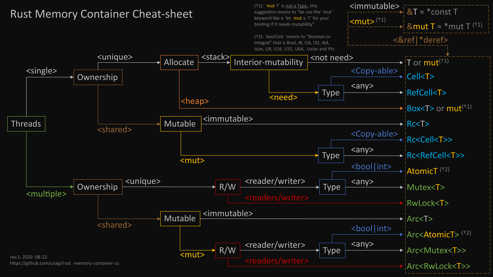

---
 变量
---


```rust
//可以放在代码任何地方,变量不可在最外层
const var1:i32=1;//常量:非固定内存地址,不可改动
static mut a:i32=1;//静态变量:固定内存地址,mut为不安全数据,只赋值一次
let u8=b'z';//u8类型定义
```

所有权类型仅BOX可以解引用

```rust
let b=Box::new(aa{});//非复制类型
let c=*b;//b 不在可用
//默认 Box<T+'static>; 如果T非'static 需主动声明 Box<T+'c>
```

Deref需返回引用

```rust
impl Deref for YOUSTRUCT{
    fn deref(&self) -> &YOUSTRUCT {
        &**YOUSTRUCT;
    }
}
```

不可COPY元素数组初始化

```rust
let c:[Option<Box<i32>>;10]=Default::default();//[None;10];
```

常用函数说明

> borrow|borrow\_mut 跟 & | & mut 一致\
> Option 的as\_ref|as_mut 对包内部数据的包裹内引用,基本类型没这方法_\
> _Box 的as\_ref|as\_mut 为得到内部包数据的引用,基本类型没这方法_\
> 不可拷贝数据注意所有权问题

```rust
//as_ref as_mut 同外壳的内部引用[Option] 或 直接对壳内的数据引用[Box]
let a=Result::<i32,i32>::Ok(1);
let b=a.as_ref();
let a=Some(1);
let b=a.as_ref();

//borrow borrow_mut 轻量级引用[所有类型都实现] 大部分 等于 等于 &
//某些类型 如 String Box 的 borrow 等于 待壳引用和不带壳引用[取决于返回类型定义] 大于 &
use std::borrow::{Borrow, BorrowMut};
let mut a =Result::<i32,i32>::Ok(1);
let b=a.borrow();
let b=&a;
let a=&Some(1);
let b=a.borrow();
#[derive(Eq, PartialEq)]
struct Aa{};
let a=Aa{};
assert!(a.borrow()==&a);


//示例说明
let mut a =Some(1);
let b:&Option<i32>=&a;
let b:&Option<i32>=a.borrow();//等价于 &a一样
let b:&mut Option<i32>=&mut a;
let b:&mut Option<i32>=a.borrow_mut();//等价于 &mut a 一样
let b:Option<&i32>=a.as_ref();//得到 Option<&i32> 不可变引用
let b:Option<&mut i32>=a.as_mut();//得到 Option<&i32> 可变引用
let mut c=Box::new(1);
let b:&mut Box<i32>=&mut c;//BOX的可变引用
println!("{}",c);
let b:&mut Box<i32>=c.borrow_mut();//等价于 &mut c
println!("{}",c);
let b:&i32=c.as_ref();//得到包裹内值引用
let b:&mut i32=c.as_mut();//得到包裹内值可变引用
*b=4;//修改可变引用值
println!("{}",c);
let mut t=*c;//可复制值解包为复制
t=5;//解引用在修改值
println!("{}",c);
```

字符串变量

```rust
fn main() {
    let o:&'static str = "dddd";
    let b=o.to_string();
    let c=b.as_str();
    let b1=c.to_string();
    let c1=b1.as_str();
    let k=o.as_ptr();
    let k1=c.as_ptr();
    let k2=c1.as_ptr();
    //k != k1 !=k2
    //每次to_string 都创建新的对象
    println!("finish");
}
```

> 借用需要所有权获得&#x20;

```
fn aaaa(mut a:&mut String){
    //let t=*a;//借用数据不可转移所有权
    let mut b=a.to_owned();//通过拷贝方式得到所有权
    println!("{:>}",b);
    *a="vff".to_string();//不转移所有权情况下修改
}
let mut bddd=&mut "sss".to_string();
aaaa(bddd);
```

> 转为位置大小类型

```rust
trait Aa{};
struct Baaa{};
impl Aa for Baaa{}
//let a= Baaa{} as dyn Aa;//错误 a 栈变量，必须知道大小
//let a= Box::new(Baaa{} as dyn Aa）;//错误 临时变量为 栈变量，必须知道大小
let a=Box::new(Baaa{} ) as Box<dyn Aa>;//正确，Box知道大小，内部为堆变量，可未知大小
fn aaa(a: Box<dyn Aa>){}
aaa(a);
let b=&Baaa{} as &dyn Aa;//正确，a为引用指针栈变量，知道大小
fn bbb(a: &dyn Aa){}
bbb(b);
//当类型为未知大小要转类型时可用 & 或 Box 封装
```


> 各种环境变量使用和示例



> ```
> 单线程
>     单所有权
>         栈
>             整体不变:T
>             整体可变:mut T 
>             内部可变:
>                 可复制:Cell<T>
>                 不可复制:RefCell<T>
>         堆:Box<T>
>     多所有权
>         不变:Rc<T>
>         可变:
>             可复制:Rc<Cell<T>>
>             不可复制:Rc<RefCell<T>>
> 多线程
>     单所有权
>         单读单写
>             BOOL或INT类型:AtomicT[Bool,i8,i16,i32,i64,isize,u8,u16,u32,usize,ptr]
>             任意类型:Mutex<T>
>         多读单写:RwLock<T>
>     多所有权 [多线程必须包一下]
>         不变:Arc<T>
>         可变:
>             单读单写
>                 BOOL或INT类型:Arc<AtomicT>
>                 任意类型:Arc<Mutex<T>>
>             多读单写:Arc<RwLock<T>>
> ```

```rust
use std::thread;
use std::cell::{Cell, RefCell};
use std::env::var;
use std::rc::Rc;
use std::borrow::{Borrow, BorrowMut};
use std::sync::atomic::{AtomicI32, Ordering};
use std::sync::{Mutex, RwLock};
use std::sync::mpsc::channel;

fn main() {

    var1();
    var2();
    var3();
    var4();
    var5();
    var6();
    var7();
    var8();
    var9();
    var10();
    var11();
    var12();
    var13();
    var14();
}


fn var14(){
    //进程间数据传递
    let (tx, rx) = channel();
    let tx1=tx.clone();
    let t1=thread::spawn(move||{//会把tx所有权转移入闭包,进程退出时释放
        tx.send(11).unwrap();
    });
    t1.join().unwrap();
    let t2=thread::spawn(move ||{//会把tx1所有权转移入闭包,进程退出时释放
        tx1.send(12).unwrap();
    });
    t2.join().unwrap();
    //Sender会在进程时释放
    //使用 rx.iter() 生产者必须完成释放,否则进入阻塞
    for a in rx.iter(){
        println!("{}",a);
    }
}

fn var13(){
    //多线程[任意类型]读写
    #[derive(Debug)]
    struct rgt{a:i32}
    let mg:Arc<RwLock<rgt>>=Arc::new(RwLock::new(rgt{a:1}));
    let img1=mg.clone();
    let t1=thread::spawn(move||{
        let mut t=img1.write().unwrap();
        t.a=10;
    });
    let img2=mg.clone();
    let t2=thread::spawn(move ||{
        let mut t=img2.write().unwrap();
        println!("{:?}",t.a);
        t.a=11;
    });
    t2.join().unwrap();
    t1.join().unwrap();
    println!("{:?}",mg.read().unwrap().a);
}

fn var12(){
    //多线程[任意类型]锁定
    #[derive(Debug)]
    struct mgt{a:i32}
    let mg:Arc<Mutex<mgt>>=Arc::new(Mutex::new(mgt{a:1}));
    let img1=mg.clone();
    let t1=thread::spawn(move||{
        let mut t=img1.lock().unwrap();
        println!("{:?}",t);
        t.a=10;
    });
    let img2=mg.clone();
    let t2=thread::spawn(move ||{
        let mut t=img2.lock().unwrap();
        println!("{:?}",t);
        t.a=11;
    });
    t2.join().unwrap();
    t1.join().unwrap();
    println!("{:?}",mg.lock().unwrap());
}
fn var11(){
    //多线程[整数 布尔] 可变
    let mg:Arc<AtomicI32>=Arc::new(AtomicI32::new(11));
    let img1=mg.clone();
    let t1=thread::spawn(move||{
        img1.fetch_add(1,Ordering::Relaxed);
        println!("{}",img1.load(Ordering::Relaxed));
    });
    let img2=mg.clone();
    let t2=thread::spawn(move ||{
        img2.fetch_add(1,Ordering::Relaxed);
        println!("{}",img2.load(Ordering::Relaxed));
    });
    t2.join().unwrap();
    t1.join().unwrap();
    println!("{}",mg.load(Ordering::Relaxed));
}
fn var10(){
    //多线程不可变
    let mg:Arc<i32>=Arc::new(1);
    let img1=mg.clone();
    let t1=thread::spawn(move||{
        println!("{}",img1);
    });
    let img2=mg.clone();
    let t2=thread::spawn(move ||{
        println!("{}",img2);
    });
    t2.join().unwrap();
    t1.join().unwrap();
}


fn var9(){
    //多线程唯一所有权
    //Mutex 不能 static
    let tmg:Mutex<i32>=Mutex::new(1);
    {
        let mut b=tmg.lock().unwrap();
        *b=101;
        println!("{}",b);
    }
}

//Atomic*系列变量
static ag:AtomicI32=AtomicI32::new(11);
fn var8(){
    //多线程全局简单变量[bool或int][可变]
    let t1=thread::spawn(move ||{
        ag.fetch_add(1,Ordering::Relaxed);
        println!("{}",ag.load(Ordering::Relaxed));
    });
    let t2=thread::spawn(move ||{
        ag.fetch_add(1,Ordering::Relaxed);
        println!("{}",ag.load(Ordering::Relaxed));
    });
    t1.join().unwrap();
    t2.join().unwrap();
}
fn var7(){
    //多所有权可变 引用可变
    #[derive(Debug)]
    struct at{
        a:i32
    }
    fn myd(t:Rc<RefCell<at>>){}
    let a =Rc::new(RefCell::new(at{a:1}));//a有所有权
    let b=a.clone();//b有所有权
    let c=Rc::downgrade(&a);//c 没有所有权 一般用在重复引用如链表
    //包里的方法有重复 as &RefCell<at> 强制转义
    (a.borrow() as &RefCell<at>).borrow_mut().a=111;
    println!("{}",(a.borrow() as &RefCell<at>).borrow().a);//访问
    //对无所有权的获取和赋值
    //注意:需要转移 as Rc<RefCell<at>> 不然编译器无法识别对应类型
    ((c.upgrade().unwrap() as Rc<RefCell<at>>).borrow() as &RefCell<at>).borrow_mut().a=1111;
    println!("{}",(a.borrow() as &RefCell<at>).borrow().a);//访问
    myd(b);//消耗b
    myd(a);//消耗a
}
fn var6(){
    //多所有权可变 非引用可变
    fn myd(t:Rc<Cell<i32>>){}
    let a=Rc::new(Cell::new(11));//a有所有权
    let b=a.clone();//b有所有权
    let c=Rc::downgrade(&a);//c 没有所有权 一般用在重复引用如链表
    a.replace(12);
    println!("{}",a.get());//访问
    println!("{:?}",c.upgrade().unwrap().replace(13));
    println!("{}",a.get());//访问
    myd(b);//消耗b
    myd(a);//消耗a
}
fn var5(){
    //多所有权不可变
    #[derive(Debug)]
    struct at{
        a:i32
    }
    fn myd(t:Rc<at>){}
    let a=Rc::new(at{a:1});//a有所有权
    let b=a.clone();//b有所有权
    println!("a initial rc count = {}", Rc::strong_count(&a));
    let c=Rc::downgrade(&a);//c 没有所有权 一般用在重复引用如链表
    println!("a initial rc count = {}", Rc::strong_count(&a));
    //弱引用没所有权,通过 c.upgrade() 方法拿到弱引用对象
    //当对象未释放时返回,释放时返回none,所以弱引用可以没有所有权
    println!("{:?}",c.upgrade().unwrap().a);
    println!("{}",a.a);//可直接访问
    //a.a=2;//不可变
    myd(b);//消耗b
    myd(a);//消耗a
    //c.upgrade().unwrap();//这里取弱引用时拿不到 对象已被释放
}
fn var4(){
    fn out()->Box<i32>{
        //堆中内存分配
        let a=Box::new(11);
        //非栈拷贝,返回胖指针
        return a;
    }
    //t为在堆中内存
    let t=out();
    println!("{}",t);
}
fn var3(){
    #[derive(Debug)]
    struct at{
        a:i32
    }
    let t=at{a:1};
    //a外部不可变 内部可变
    let a=RefCell::new(t);//注意这里传入t非&t 但实现&t引用 一般用在结构等
    //取内部可变的引用对象进行修改
    a.borrow_mut().a=11;
    println!("{:?}",a);
}
fn var2(){
    //a本身不可变内部可变
    let a=Cell::new(1);
    //替换内部数据
    a.replace(2);
    println!("{:?}",a);
}
fn var1(){
    //单线程可变或不可变
    let a=1;
    let mut b=1;//可变
    let c=b+1;
    println!("{}{}{}",a,b,c);
}

```

> 可变值借用后不可变

```rust
 let mut b=1;
 let sss= || {
     println!("{}",b);
 };
 sss();
 b=2;//编译器能识别 sss 在下文不在使用
// let t=sss;//如果sss在使用，由于可变值借用后不可修改，所以会报错
```

条件变量示例

```rust
use std::sync::{Arc, Condvar, Mutex};
use std::thread;
fn main() {
    let pair = Arc::new((Mutex::new(false), Condvar::new()));
    let pair_clone = pair.clone();
    thread::spawn(move || {
        let &(ref lock, ref cvar) = &*pair_clone;
        let mut started = lock.lock().unwrap();
        *started = true;
       cvar.notify_one();
   });
   let &(ref lock, ref cvar) = &*pair;
   let mut started = lock.lock().unwrap();
   while !*started {
       println!("{}", started); // false
       started = cvar.wait(started).unwrap();//lock 只能被一个Condvar绑定 lock被多个绑定时完成时只触发第一个
       println!("{}", started); // true
   }
}
```

Turbofish 操作

```rust
struct A{}
trait T{ fn b<T>(a:T)->T;}
impl A{
    fn a<T>(a:T)->T{
        a
    }
}
impl T for A{
    fn b<T>(a:T)->T{
        a
    }
}
let a=A::a::<i8>(1);//类型的turbofish操作
let b=T::b::<i8>(1);//trait 的Turbofish操作
//Turbofish 只能用在声明的ITEM上
```

> 动态类型变量获取类型并调用类型方法

```rust
fn main() {
    struct A{}
    struct B{}
    trait C{
        fn b()->i32;
    }
    impl C for A{
        fn b()->i32{1}
    }
    impl C for B{
        fn b()->i32{2}
    }
    fn aa()->Box<impl C>{
        Box::new(A{})
    }
    fn bb()->Box<impl C>{
        Box::new(B{})
    }
    let t0=aa();
    let t1=bb();
    fn call_bb<T:C>(_:&Box<T>)->i32{
        T::b()
    }
    println!("{}",call_bb(&t0));
    println!("{}",call_bb(&t1));
}
```
